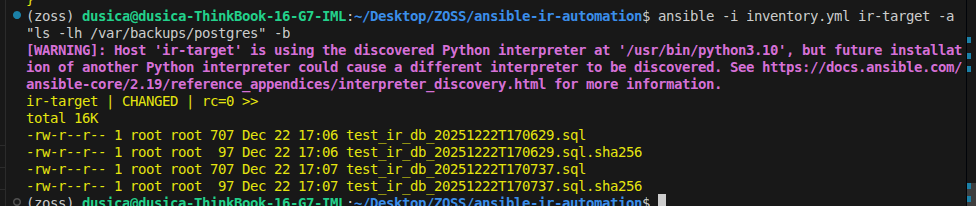
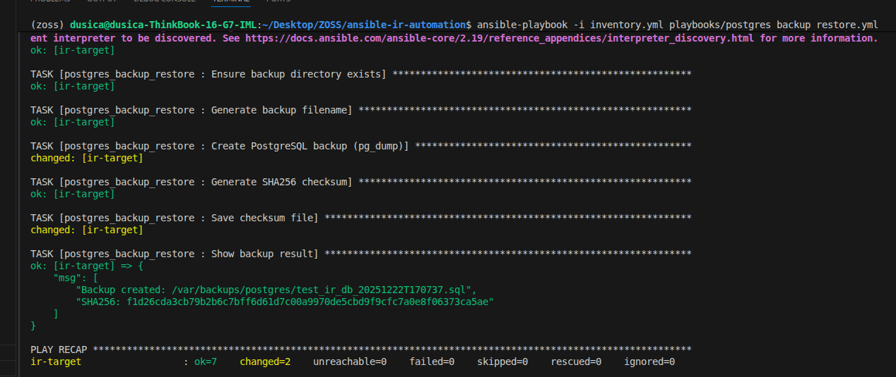
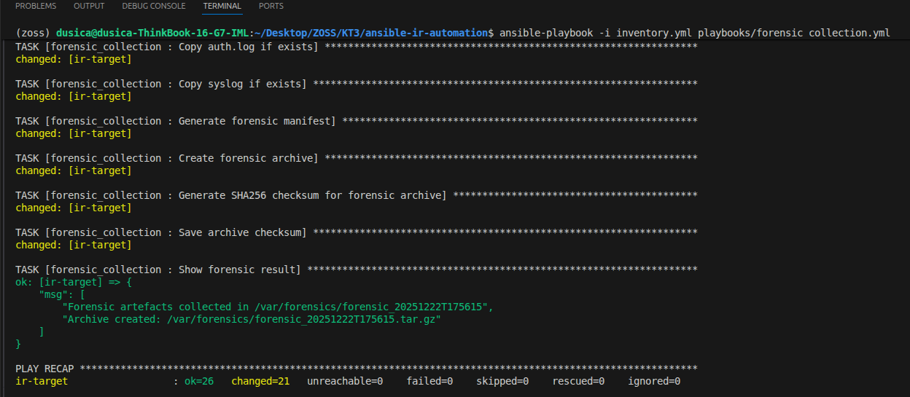
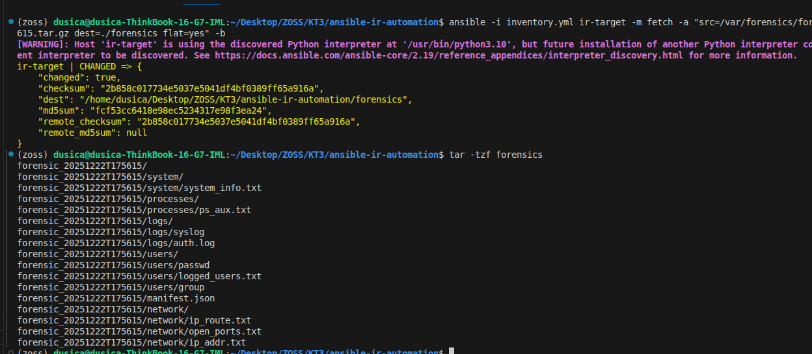

# Ansible Incident Response Automation

Ovaj projekat implementira osnovne automatizacije za Incident Response (IR) scenarije
na Linux sistemu korišćenjem Ansible alata.

Cilj projekta je demonstracija:
- bezbednog backup-a baze podataka
- prikupljanja forenzičkih artefakata
- očuvanja integriteta podataka (checksums, read-only kopiranje)

Projekat je namenjen akademskoj upotrebi i individualnom radu.

---

## Struktura projekta
```text
ansible-ir-automation/
├── playbooks/
│   ├── postgres_backup_restore.yml
│   └── forensic_collection.yml
├── roles/
│   ├── postgres_backup_restore/
│   │   ├── tasks/
│   │   │   └── main.yml
│   │   └── vars/
│   │       └── main.yml
│   └── forensic_collection/
│       └── tasks/
│           └── main.yml
├── inventory.yml
├── ansible.cfg
└── forensics/
    └── (preuzeti forenzički artefakti)
```
---

## Opis komponenti

### inventory.yml
Definiše ciljni sistem (IR target) i parametre za SSH konekciju.

### ansible.cfg
Osnovna Ansible konfiguracija (kontrola warning-a, ponašanje konekcije).

---

### PostgreSQL Backup Automation

Playbook:  
playbooks/postgres_backup_restore.yml

Ova komponenta:
- kreira PostgreSQL backup pomoću pg_dump
- generiše timestamped naziv fajla
- čuva backup u definisanom direktorijumu
- generiše SHA256 checksum backup fajla

Backup fajlovi se čuvaju na target host-u u:
`/var/backups/postgres`

```bash
ansible -i inventory.yml ir-target -a "ls -lh /var/backups/postgres" -b
```


---

### Forensic Collection (Linux)

Playbook:  
playbooks/forensic_collection.yml

Ova komponenta prikuplja osnovne forenzičke artefakte sa Linux sistema:

- sistemske informacije
- aktivne procese
- mrežne informacije (portovi, routing)
- sistemske logove (ako postoje)

Artefakti se:
- kopiraju u read-only režimu
- pakuju u `.tar.gz` arhivu
- štite SHA256 checksum-om
- opisuju kroz `manifest.json` sa metapodacima

Forenzička arhiva se kreira na target host-u u:
`/var/forensics/`

---

## Pokretanje

### PostgreSQL backup

```bash
ansible-playbook -i inventory.yml playbooks/postgres_backup_restore.yml
```



### Prikupljanje forenzičkih artefakata

```bash
ansible-playbook -i inventory.yml playbooks/forensic_collection.yml
```



---

## Preuzimanje forenzičke arhive na lokalni sistem

```bash
ansible -i inventory.yml ir-target -m fetch -a \
    "src=/var/forensics/<ARCHIVE_NAME>.tar.gz dest=./forensics flat=yes" -b
```



---

## Bezbednosni aspekti

- Podaci se ne menjaju na target sistemu
- Kopiranje se vrši read-only
- Checksum omogućava proveru integriteta
- Automatizacija je pogodna za IR i audit scenarije

---
