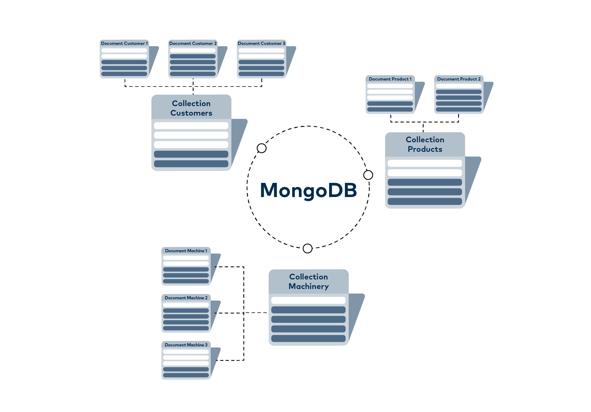
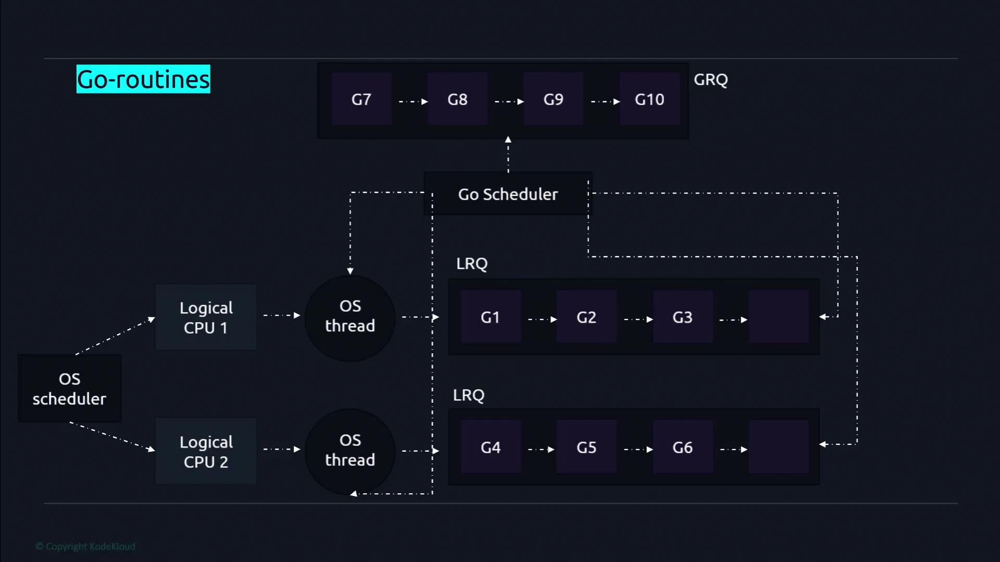

# KT2 - Arhitektura sistema i pregled tehnologija

# 1. Opšti opis projekta
Projekat *UrbanSense* predstavlja softverski sistem namenjen prikupljanju, obradi i analizi podataka dobijenih sa distribuiranih IoT senzora u urbanom okruženju. Osnovni cilj sistema je da omogući centralizovano upravljanje i obradu velike količine podataka sa senzora, kao i njihovu dostupnost eksternim sistemima kroz standardizovane interfejse. Na taj način, sistem pruža osnovu za praćenje stanja okruženja i donošenje odluka zasnovanih na prikupljenim podacima.

Sistem je koncipiran tako da omogući kontinuiran prijem podataka sa senzora, njihovu dalju obradu i agregaciju, kao i pouzdano skladištenje radi kasnijeg korišćenja. Poseban akcenat stavljen je na modularnost i jasnu podelu odgovornosti između komponenti sistema, čime se obezbeđuje skalabilnost i lakša integracija sa spoljnim aplikacijama. Projekat ne obuhvata razvoj korisničkog interfejsa, već se fokusira na serversku stranu sistema i mehanizme razmene podataka sa eksternim klijentima.

# 2. Arhitektura sistema na visokom nivou
Arhitektura sistema *UrbanSense* zasniva se na jasno definisanim komponentama koje zajedno omogućavaju prikupljanje, obradu i distribuciju podataka sa IoT senzora. Na slici je prikazan arhitektonski dijagram sistema koji ilustruje glavne komponente projekta i njihove međusobne odnose, kao i tokove podataka između njih.

Centralnu ulogu u arhitekturi ima **centralna komponenta sistema** UrbanSense, koja predstavlja jezgro sistema i zadužena je za koordinaciju komunikacije između ostalih komponenti. Ova komponenta prima podatke sa IoT senzora, upravlja njihovom daljom obradom i obezbeđuje pristup obrađenim informacijama eksternim sistemima putem definisanih interfejsa.

Podaci prikupljeni sa senzora prosleđuju se centralnoj komponenti sistema, gde se vrši njihova obrada i agregacija, nakon čega se čuvaju u **sloju za skladištenje podataka**. Ovaj sloj omogućava trajno čuvanje podataka i njihovu dostupnost za kasnije analize i upite. Pored toga, arhitektura predviđa komunikaciju sa eksternim sistemima, koji putem API zahteva mogu pristupati obrađenim podacima ili inicirati određene funkcionalnosti sistema.

Ovakva arhitektonska organizacija omogućava jasnu podelu odgovornosti između komponenti, jednostavno proširenje sistema i prilagođavanje različitim scenarijima korišćenja, bez narušavanja osnovne strukture sistema.

  

# 3. Tok podataka i međusobna komunikacija komponenti
Tok podataka u sistemu *UrbanSense* započinje na nivou IoT senzora, koji generišu podatke o stanju okruženja u realnom vremenu. Ovi podaci se kontinuirano prosleđuju centralnoj komponenti sistema, čime se obezbeđuje pravovremeni prijem informacija sa distribuiranih izvora. Komunikacija između senzora i centralne komponente ostvaruje se putem mehanizma za razmenu poruka, što omogućava efikasan i pouzdan prenos podataka.

Nakon prijema podataka, centralna komponenta sistema vrši njihovu obradu i agregaciju u skladu sa definisanim pravilima sistema. Obrađeni podaci se zatim prosleđuju sloju za skladištenje podataka, gde se trajno čuvaju i postaju dostupni za dalju upotrebu. Na ovaj način obezbeđena je konzistentnost podataka i mogućnost njihovog kasnijeg korišćenja u različitim kontekstima.

Pored obrade i skladištenja podataka, sistem omogućava komunikaciju sa eksternim sistemima putem programskog interfejsa. Eksterni sistemi mogu slati zahteve ka centralnoj komponenti sistema radi pristupa obrađenim i agregiranim podacima, kao i dobijati odgovore u skladu sa definisanim pravilima sistema. Ovakav tok komunikacije omogućava integraciju sistema *UrbanSense* sa različitim klijentskim aplikacijama i spoljnim servisima, uz jasno definisane granice odgovornosti između komponenti.

# 4. Sloj za prikupljanje podataka sa senzora
Sloj za prikupljanje podataka sa senzora predstavlja ulaznu tačku sistema *UrbanSense* i zadužen je za prijem podataka generisanih od strane distribuiranih IoT senzora. Ova komponenta omogućava kontinuirano i asinhrono slanje podataka ka centralnoj komponenti sistema, čime se obezbeđuje efikasan prijem informacija iz fizičkog okruženja.

U okviru projekta, senzori ne komuniciraju direktno sa slojem za skladištenje podataka niti sa eksternim sistemima, već isključivo sa centralnom komponentom sistema. Na ovaj način postiže se jasna separacija odgovornosti, gde je sloj za prikupljanje podataka fokusiran isključivo na pouzdano slanje podataka, bez dodatne logike obrade ili validacije.

Komunikacija između senzora i centralne komponente realizovana je korišćenjem mehanizma za razmenu poruka, koji omogućava skalabilnost sistema i toleranciju na privremene prekide u radu pojedinih senzora.

# 5. Centralna obrada i upravljačka logika sistema
Centralna komponenta sistema *UrbanSense* predstavlja jezgro sistema i zadužena je za obradu, validaciju i agregaciju podataka pristiglih sa senzora. Ova komponenta koordinira komunikaciju između svih ostalih delova sistema i obezbeđuje da podaci budu obrađeni u skladu sa definisanim pravilima projekta.

Nakon prijema podataka, centralna komponenta vrši osnovnu obradu i pripremu podataka za dalju upotrebu, uključujući objedinjavanje podataka iz različitih izvora i njihovo strukturiranje. Na ovaj način sistem omogućava konzistentan prikaz podataka bez obzira na izvor ili učestalost njihovog generisanja.

Pored obrade podataka, centralna komponenta sistema odgovorna je i za komunikaciju sa eksternim sistemima putem programskog interfejsa. Ona predstavlja jedinu tačku pristupa sistemu UrbanSense za spoljne klijente, čime se obezbeđuje kontrolisan i centralizovan pristup funkcionalnostima sistema.

# 6. Sloj za skladištenje podataka
Sloj za skladištenje podataka zadužen je za trajno čuvanje obrađenih i agregiranih podataka unutar sistema *UrbanSense*. Ova komponenta omogućava pouzdano skladištenje podataka i njihovu dostupnost za kasnije analize, izveštavanje i pristup od strane eksternih sistema.

U okviru projekta skladište podataka ne učestvuje direktno u komunikaciji sa senzorima ili eksternim sistemima, već isključivo sarađuje sa centralnom komponentom sistema. Na ovaj način se obezbeđuje dodatni nivo kontrole nad podacima i smanjuje kompleksnost interakcija između komponenti.

Izabrani pristup skladištenju podataka omogućava fleksibilno čuvanje velike količine heterogenih podataka, što je posebno značajno u kontekstu sistema koji obrađuje podatke sa različitih senzora.

# 7. Integracija sa eksternim sistemima
Sistem *UrbanSense* predviđa integraciju sa eksternim sistemima koji imaju potrebu za pristupom obrađenim i agregiranim podacima. Ovi sistemi mogu predstavljati klijentske aplikacije, analitičke alate ili druge softverske sisteme koji koriste podatke u svrhu daljeg prikaza ili obrade.

Komunikacija sa eksternim sistemima ostvaruje se putem jasno definisanog programskog interfejsa, preko kojeg eksterni sistemi mogu slati zahteve i dobijati odgovore od centralne komponente sistema. Na ovaj način obezbeđena je standardizovana i kontrolisana razmena podataka, bez direktnog pristupa internim komponentama sistema.

Ovakav pristup integraciji omogućava lako proširenje sistema i povezivanje sa različitim klijentima, uz očuvanje stabilnosti i osnovne arhitekture sistema.

# 8. Tehnologije u kontekstu projekta

## 8.1. MQTT

Message Queuing Telemetry Transport (MQTT) je komunikacioni protokol dizajniran za efikasnu i pouzdanu razmenu poruka u okruženjima sa ograničenim resursima, što ga čini pogodnim za IoT sisteme poput projekta UrbanSense. Za razliku od tradicionalnih modela komunikacije zasnovanih na principu zahtev–odgovor, MQTT koristi publish/subscribe paradigm, u kojoj proizvođači poruka (publishers) objavljuju podatke na određene teme, dok se potrošači (subscribers) pretplaćuju na teme od interesa. Ovakav pristup omogućava visok stepen razdvajanja između komponenti sistema i olakšava skalabilnost komunikacije.

Jedna od ključnih karakteristika MQTT protokola jeste njegova lightweight priroda. Protokol je projektovan tako da minimizira količinu prenetih podataka i broj potrebnih mrežnih operacija, što je naročito važno u scenarijima gde uređaji imaju ograničene hardverske resurse ili rade u nestabilnim mrežnim uslovima. Istraživanja pokazuju da ovakav dizajn omogućava pouzdanu komunikaciju čak i u uslovima visoke latencije ili povremenih prekida veze, što je česta pojava u distribuiranim senzorskim mrežama.

Posebna vrednost MQTT protokola dolazi do izražaja u kontekstu pametnih gradova i sistema za prikupljanje podataka u realnom vremenu. U radu koji se bavi primenom MQTT-a u Smart City okruženjima, protokol se identifikuje kao centralni mehanizam za razmenu podataka između velikog broja senzora i serverskih komponenti, uz podršku za interoperabilnost i obradu događaja u realnom vremenu. Dodatno, studije koje analiziraju kompletne end-to-end IoT sisteme zasnovane na MQTT-u pokazuju da ovaj protokol omogućava efikasnu integraciju senzora, gateway uređaja i centralnih sistema za obradu i vizualizaciju podataka.

U okviru projekta UrbanSense, MQTT protokol se koristi kao osnovni komunikacioni mehanizam između IoT senzora i centralne komponente sistema. Njegova publish/subscribe arhitektura omogućava asinhronu razmenu podataka, pri čemu senzori mogu nezavisno slati informacije bez potrebe za direktnom vezom sa ostalim komponentama sistema. Ovakav pristup olakšava dodavanje novih senzora, smanjuje međuzavisnost komponenti i povećava otpornost sistema na greške.

Zahvaljujući navedenim osobinama, MQTT predstavlja prirodan izbor za komunikacioni sloj sistema UrbanSense, jer omogućava skalabilan, efikasan i pouzdan prenos podataka iz fizičkog okruženja ka centralnom delu sistema, uz minimalne mrežne i hardverske zahteve.

### Reference

- MQTT Protocol for the IoT – Review Paper  
  https://www.researchgate.net/publication/373640610_MQTT_Protocol_for_the_IoT_-_Review_Paper

- IoT real time data acquisition using MQTT protocol  
  https://www.researchgate.net/publication/317391853_IoT_real_time_data_acquisition_using_MQTT_protocol

- MQTT for IoT-based Applications in Smart Cities  
  https://www.researchgate.net/publication/393527462_MQTT_For_Iot-Based_Applications_In_Smart_Cities

- Open-Source MQTT-Based End-to-End IoT System for Smart City Scenarios  
  https://www.mdpi.com/1999-5903/14/2/57

### Ilustracija

  <i>Konceptualna ilustracija publish/subscribe modela komunikacije koji koristi MQTT protokol.</i>

## 8.2. NoSQL baze podataka

Sistemi za prikupljanje podataka u IoT okruženjima karakterišu se velikom količinom zapisa, visokom frekvencijom upisa i heterogenom strukturom podataka. Senzori mogu generisati različite tipove merenja, sa promenljivim skupovima atributa, koji se vremenom mogu proširivati ili menjati. U takvim uslovima, klasični relacioni model podataka, zasnovan na strogo definisanim šemama i relacijama, često predstavlja ograničenje u pogledu fleksibilnosti i prilagodljivosti sistema.

NoSQL baze podataka nastaju kao odgovor na potrebe sistema koji obrađuju velike količine polustrukturiranih i nestrukturiranih podataka. Umesto stroge šeme definisane unapred, NoSQL sistemi se oslanjaju na pristup *schema-on-read*, gde se struktura podataka interpretira na nivou aplikacije. Ovakav pristup omogućava da se podaci skladište u obliku koji je bliži njihovoj prirodnoj reprezentaciji, bez potrebe za čestim izmenama šeme baze prilikom evolucije sistema.

MongoDB predstavlja dokumentno orijentisanu NoSQL bazu podataka, u kojoj se podaci skladište u obliku dokumenata organizovanih u kolekcije. Dokumenti su najčešće predstavljeni u JSON-sličnom formatu, što omogućava da jedan dokument obuhvati kompletan skup podataka koji logički pripadaju jednom entitetu, kao što su merenja jednog senzora u određenom vremenskom periodu. Na ovaj način se smanjuje potreba za složenim spajanjima podataka i omogućava efikasnije čitanje i obrada podataka.

Jedna od ključnih osobina MongoDB baze jeste njena sposobnost horizontalnog skaliranja. Sistem je dizajniran tako da podrži rad sa velikim brojem zapisa kroz shardovanje (horizontalnu particiju) podataka i raspodelu opterećenja na više instanci baze. Ovakav dizajn je posebno pogodan za IoT sisteme, gde veliki broj senzora kontinuirano generiše podatke, što dovodi do visokog intenziteta upisa. Istraživanja i empirijske studije ukazuju da MongoDB pokazuje dobre performanse u scenarijima sa velikim brojem operacija upisa i čitanja, što je čest slučaj u realnom vremenu.

Primena dokumentnog modela u projektu UrbanSense omogućava prirodno mapiranje senzorskih podataka na strukturu baze. Svako merenje ili skup merenja može se predstaviti kao poseban dokument, pri čemu različiti tipovi senzora mogu imati različite atribute bez narušavanja konzistentnosti sistema. Ovakav pristup omogućava jednostavno proširenje sistema dodavanjem novih senzora ili novih tipova podataka, bez potrebe za značajnim izmenama u strukturi skladišta podataka.

Iako dokumentni NoSQL pristup donosi visok stepen fleksibilnosti, on podrazumeva i određene kompromisne odluke. Nedostatak stroge šeme i relacione kontrole integriteta zahteva da se deo logike validacije i konzistentnosti podataka prebaci na aplikativni sloj sistema. U kontekstu projekta UrbanSense, ovaj pristup je prihvatljiv, s obzirom na to da centralna komponenta sistema već preuzima ulogu obrade i validacije podataka pre njihovog skladištenja.

Na osnovu navedenih karakteristika, MongoDB predstavlja adekvatan izbor za sloj za skladištenje podataka u okviru sistema UrbanSense. Njena fleksibilnost, skalabilnost i prilagođenost radu sa velikim količinama heterogenih senzorskih podataka omogućavaju pouzdano i efikasno skladištenje informacija, uz podršku daljem razvoju i proširenju sistema.

### Reference

- Scaling with MongoDB: Solutions for Handling Big Data in Real-Time  
  https://www.researchgate.net/publication/389682323_Scaling_with_MongoDB_Solutions_for_Handling_Big_Data_in_Real-Time

- A Comparative Analysis of NoSQL and SQL Databases with a Focus on IoT  
  https://www.researchgate.net/publication/390609163_A_Comparative_Analysis_of_NoSQL_and_SQL_Databases_Performance_Consistency_and_Suitability_for_Modern_Applications_with_a_Focus_on_IoT

- A Study of Performance and Comparison of NoSQL Databases (MongoDB, Cassandra, Redis)  
  https://indjst.org/articles/a-study-of-performance-and-comparison-of-nosql-databases-mongodb-cassandra-and-redis-using-ycsb

- NoSQL Databases in Real-Time Systems: Performance, Scalability, Use Case Analysis  
  https://ijdim.com/journal/index.php/ijdim/article/download/272/246/621

- When to Use MongoDB Over a Relational Database (community discussion)  
  https://softwareengineering.stackexchange.com/questions/54373/when-would-someone-use-mongodb-or-similar-over-a-relational-dbms

### Ilustracija

  <i>Primer dokumentno orijentisanog modela podataka, gde se zapisi skladište kao fleksibilni dokumenti unutar kolekcija.</i>

## 8.3. Go programski jezik

Go programski jezik je dizajniran sa jasnim ciljem da olakša razvoj pouzdanih i skalabilnih sistema koji rade u okruženjima sa velikim brojem istovremenih operacija. Za razliku od tradicionalnih jezika u kojima je konkurentnost dodatni sloj nad osnovnim izvršnim modelom, Go integriše konkurentno programiranje direktno u srž jezika i njegov runtime sistem. Na taj način, konkurentnost postaje fundamentalni princip izvršavanja, a ne samo programska tehnika.

Osnovna ideja konkurentnosti u Go jeziku zasniva se na odvajanju logike izvršavanja programa od upravljanja fizičkim resursima računara. Programer izražava konkurentnost kroz jezičke konstrukte, dok Go runtime preuzima odgovornost za efikasno raspoređivanje izvršavanja na dostupne procesorske i sistemske resurse. Ovakav pristup omogućava pisanje jednostavnog i čitljivog konkurentnog koda, bez potrebe za eksplicitnim upravljanjem nitima operativnog sistema.

Na slici ispod prikazan je konceptualni konkurentni izvršni model Go jezika, koji ilustruje kako se veliki broj gorutina mapira na ograničen broj logičkih procesora i operativno-sistemskih niti, uz potpunu kontrolu runtime sistema.

  <i>Konceptualni prikaz konkurentnog izvršnog modela Go jezika, u kome se gorutine mapiraju na logičke procesore i operativno-sistemske niti pod upravom runtime sistema.</i>

---

### Goroutines kao osnovna konkurentna jedinica

Gorutine predstavljaju osnovne jedinice konkurentnog izvršavanja u Go jeziku. One se mogu posmatrati kao lake izvršne niti koje upravlja Go runtime, a ne operativni sistem. Za razliku od klasičnih OS niti, gorutine imaju veoma mali početni memorijski otisak i mogu se kreirati u velikom broju bez značajnog opterećenja sistema.

Jedna od ključnih razlika između gorutina i operativno-sistemskih niti jeste način njihovog upravljanja. Dok OS niti direktno zavise od mehanizama operativnog sistema i imaju relativno visoku cenu kreiranja i prebacivanja konteksta, gorutine su potpuno kontrolisane od strane runtime-a jezika. To omogućava brže prebacivanje konteksta, efikasnije korišćenje resursa i lakše izražavanje konkurentnih tokova izvršavanja u okviru aplikacije.

Konkurentni model zasnovan na gorutinama omogućava da se veliki broj nezavisnih zadataka izvršava paralelno ili konkurentno, bez potrebe da programer vodi računa o broju dostupnih niti ili procesora. Runtime sistem dinamički upravlja njihovim raspoređivanjem, čime se postiže bolja skalabilnost i stabilnost sistema.

  <i>Ilustracija odnosa između gorutina, logičkih procesora i operativno-sistemskih niti u Go konkurentnom modelu.</i>

---

### Go scheduler i G–M–P model

Upravljanje izvršavanjem gorutina vrši se putem Go scheduler-a, koji predstavlja ključnu komponentu runtime sistema. Scheduler koristi G–M–P model, gde oznaka G predstavlja gorutine, M označava operativno-sistemske niti, dok P predstavlja logičke procesore koji služe kao posredni sloj između gorutina i niti.

Logički procesori predstavljaju izvršne resurse koje scheduler dodeljuje gorutinama. Svaki procesor održava sopstveni red spremnih gorutina, dok scheduler dinamički balansira opterećenje između dostupnih procesora i niti. Ovakav model omogućava efikasno raspoređivanje gorutina, smanjuje zastoje u izvršavanju i omogućava bolju iskorišćenost višejezgarnih procesora.

Zahvaljujući G–M–P modelu, Go runtime može transparentno da premešta gorutine između niti, da pauzira i nastavlja njihovo izvršavanje, kao i da reaguje na blokirajuće sistemske pozive, bez potrebe za intervencijom programera. Ovaj mehanizam predstavlja osnovu skalabilnosti i performansi Go jezika u konkurentnim okruženjima.

  <i>Prikaz G–M–P modela koji koristi Go runtime za raspoređivanje gorutina na operativno-sistemske niti.</i>

---

### Go channels i model razmene poruka

Pored gorutina, Go uvodi i kanale kao osnovni mehanizam za bezbednu komunikaciju između konkurentnih tokova izvršavanja. Kanali omogućavaju razmenu podataka između gorutina bez potrebe za eksplicitnim korišćenjem zaključavanja ili deljene memorije. Ovakav pristup zasniva se na principima message-passing konkurentnosti i inspiriše se CSP (Communicating Sequential Processes) modelom.

Korišćenjem kanala, Go podstiče stil programiranja u kome gorutine međusobno komuniciraju slanjem poruka, umesto direktnim deljenjem podataka. Time se smanjuje rizik od trka podataka, nekonzistentnih stanja i složenih sinhronizacionih problema. Runtime sistem obezbeđuje da se operacije nad kanalima izvršavaju bezbedno i efikasno, čak i u prisustvu velikog broja gorutina.

Kanali, u kombinaciji sa gorutinama i scheduler-om, čine osnovu Go konkurentnog modela i omogućavaju izgradnju robusnih i skalabilnih sistema sa jasno definisanim tokovima komunikacije.

---

### Upravljanje memorijom: stack growth i garbage collector

Go runtime obuhvata i mehanizme za automatsko upravljanje memorijom, koji dodatno doprinose efikasnosti konkurentnog izvršavanja. Gorutine započinju izvršavanje sa malim stekom, koji se dinamički proširuje tokom rada u zavisnosti od potreba programa. Ovakav pristup omogućava postojanje velikog broja gorutina bez značajnog memorijskog opterećenja.

Pored dinamičkog upravljanja stekom, Go koristi i ugrađeni garbage collector, dizajniran sa fokusom na nisku latenciju i minimalne pauze u izvršavanju programa. Garbage collector radi paralelno sa aplikacijom i prilagođen je konkurentnim sistemima, čime se omogućava stabilan rad i predvidivo ponašanje programa čak i pri intenzivnom upravljanju memorijom.

Zajedno, ovi mehanizmi čine Go runtime kompletnim izvršnim okruženjem koje podržava konkurentnost, efikasno upravljanje resursima i jednostavniji razvoj kompleksnih sistema.

### Reference

- The Go Programming Language Specification  
  https://go.dev/ref/spec

- Effective Go  
  https://go.dev/doc/effective_go

- Concurrency Is Not Parallelism – Rob Pike  
  https://go.dev/blog/waza-talk

- Go Coroutine – Russ Cox  
  https://research.swtch.com/coro

- Share Memory by Communicating  
  https://go.dev/blog/codelab-share

- A Guide to the Go Garbage Collector  
  https://go.dev/doc/gc-guide

- Go Memory Model  
  https://go.dev/ref/mem

- Scheduling in Go – Part I  
  https://www.ardanlabs.com/blog/2018/08/scheduling-in-go-part1.html
  https://www.ardanlabs.com/blog/2018/08/scheduling-in-go-part2.html

